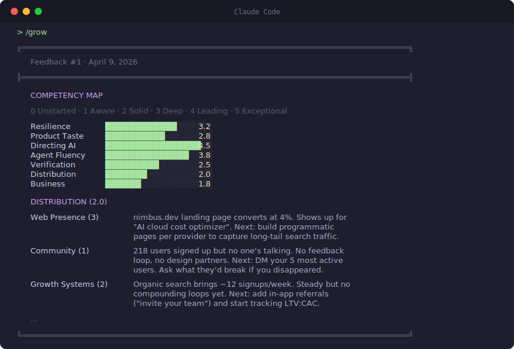

<p align="center">
  <picture>
    <source media="(prefers-color-scheme: dark)" srcset="assets/logo-dark.svg">
    <source media="(prefers-color-scheme: light)" srcset="assets/logo-light.svg">
    
  </picture>
</p>

<p align="center">
  <a href="README.md">English</a> |
  <a href="README.zh-CN.md">简体中文</a> |
  <a href="README.es.md">Español</a>
</p>

<p align="center">
  <em>Cada vez programas más rápido.</em><br>
  <em>Pero... ¿estás creciendo como desarrollador?</em>
</p>

<p align="center">
  
  
</p>

<p align="center">
  
</p>

---

**Devloop** es tu loop de crecimiento como builder de IA. Analiza tu código, tus sesiones de Claude, tu historial de git y lo que ya lanzaste. Te ubica en siete áreas de competencia y te encuentra el mejor contenido para atacar tu punto más débil.

Nada de feeds infinitos. 2-3 recomendaciones por semana, conectadas a lo que estás haciendo y dónde estás parado.

## Para quién es

- Usas herramientas de IA y entregas rápido, pero sientes que no estás aprendiendo nada en el camino
- Ya lanzaste algo y nadie lo usa, y no tienes claro qué hacer ahora
- Te llega un framework nuevo cada semana, herramientas por todos lados, FOMO constante, pero no sabes qué vale la pena y qué es ruido
- Eres founder solo o equipo chico, sin un senior, PM ni mentor que te dé feedback
- Sabes que tu punto débil no es programar, es otra cosa, pero no sabrías decir qué

## Lo que Devloop NO es

- **No es un curso.** No hay temario ni lecciones. Te dice dónde poner atención, no cómo estudiar.
- **No es un bot de code review.** Busca huecos en tus habilidades, no bugs en tu código.
- **No es para quien no ha empezado a construir.** Si todavía estás pegado con tutoriales, no hay trabajo que analizar.

## Cómo funciona

```
  /grow ······· úsalo 2-3 veces por semana
    │
    ▼
  Analizar ···· código, git, sesiones, productos lanzados
    │
    ▼
  Priorizar ··· ordenar oportunidades de crecimiento en 7 áreas
    │
    ▼
  Buscar ······ 50+ fuentes curadas en paralelo
    │
    ▼
  Recomendar ·· una pieza de contenido que te sirva de verdad
```

**Ojo: la primera vez hace un análisis completo de tu trabajo**. Gasta bastantes tokens (sobre todo si tienes un codebase grande o muchas sesiones), pero solo pasa una vez. Después de eso, cada ejecución es más rápida y precisa porque el sistema te va conociendo mejor.

## Con y sin Devloop

| Sin Devloop                                                              | Con Devloop                                                                 |
| ------------------------------------------------------------------------ | --------------------------------------------------------------------------- |
| Sabes que las herramientas de IA cambian cada semana, pero no das abasto | Una recomendación por ejecución, de 50+ fuentes, apuntada a tu hueco        |
| Crees que te falta distribución, pero no sabes por dónde arrancar        | Un mapa de competencias con evidencia real de tu código y tus sesiones      |
| Lees HN, Twitter, newsletters... te sientes al día, pero no mejoras      | Contenido ligado a tu proyecto, no listicles genéricos de "10 tips"         |
| No tienes mentor ni senior que revise tu crecimiento                     | Una evaluación honesta que te muestra tus huecos, no solo lo que haces bien |
| Sigues agregando features cuando deberías hablar con usuarios            | Te lo dice directamente y te sugiere la conversación que necesitas tener    |

## Mapa de competencias

Lo que de verdad necesitas para construir y lanzar productos de IA en 2026. Siete áreas, cada concepto de 0 a 5, basado en evidencia de tu trabajo real.

| Área                    | Qué cubre                                                                                                      |
| ----------------------- | -------------------------------------------------------------------------------------------------------------- |
| **Resiliencia**         | Rumbo, ritmo, saber cuándo insistir y cuándo pivotar, voz propia                                               |
| **Ojo de producto**     | Empatía con el usuario, claridad de valor, criterio de diseño, saber decir que no a features, sentido de PMF   |
| **Manejar IA**          | Prompting, ingeniería de contexto, desarrollo guiado por specs, evaluar herramientas, dividir tareas humano-IA |
| **Soltura con agentes** | Delegar tareas, patrones de orquestación, infra de agentes, harness engineering, saber cuándo intervenir       |
| **Verificación**        | Testing, code review, diseño de evals, seguridad, threat modeling, debugging de sistemas de IA                 |
| **Distribución**        | Presencia web y SEO, estrategia de contenido, elección de canales, comunidad, motores de crecimiento           |
| **Negocio**             | Modelo de ingresos, unit economics, temas legales, gestión financiera                                          |

## Fuentes

Cada ejecución busca en más de 50 fuentes curadas:

- **Blogs de ingeniería:** Anthropic, Stripe, Cloudflare, Vercel, Supabase, Linear, Netflix
- **Voces independientes:** Simon Willison, Julia Evans, Paul Graham, Patrick McKenzie, Eugene Yan, Lilian Weng
- **Newsletters:** Latent Space, Pragmatic Engineer, Lenny's Newsletter, One Useful Thing, First Round Review
- **Social:** Hacker News (100+ puntos), Twitter/X (@karpathy, @simonw, @swyx, @levelsio)
- **Papers:** arXiv via HuggingFace Papers, Semantic Scholar
- **Herramientas y lanzamientos:** GitHub Trending, Product Hunt, changelogs de las dependencias que usas
- **Podcasts y video:** Latent Space, Lightcone (YC), Fireship, Theo

## Arranque rápido

```bash
# En cualquier sesión de Claude Code
/install github:jackguo709/devloop
```

Después corre `/grow`. Listo. Todo corre en local.

## Privacidad

Todo vive en tu máquina. Tu perfil, observaciones e historial están en `~/.devloop/`. No hay cuenta, no hay telemetría, no se manda nada a ningún lado.

## Hoja de ruta

- [x] Escaneo inicial: código, git, sesiones CLI, sesiones de escritorio, perfiles web
- [x] Mapa de siete competencias con puntuación basada en evidencia
- [x] Recomendaciones de contenido curado de 50+ fuentes
- [x] Perfil y observaciones persistentes entre sesiones
- [ ] Hook de SessionEnd para sincronizar perfil en segundo plano
- [ ] Tracking de crecimiento (ver cómo cambian tus puntuaciones con el tiempo)
- [ ] Modo equipo (mapa colectivo de huecos de un equipo chico)
- [ ] Envío por correo

## Licencia

MIT
